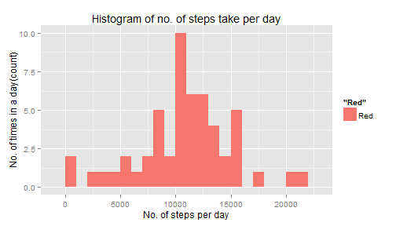
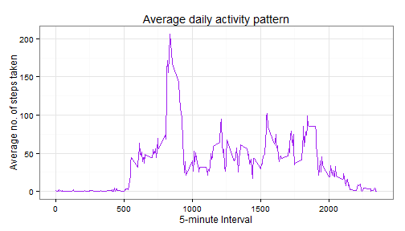
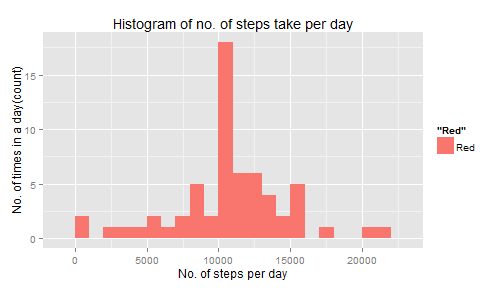
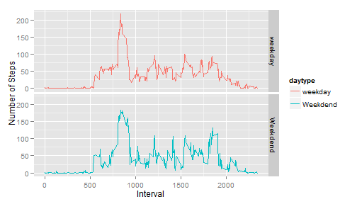

Reproducible Research - Peer Assessment 1
==============================================

####Naman Jain

11 April 2016

###Introduction

This document presents the results of peer assessments 1 of course Reproducible Research on coursera. This assignment makes use of data from a personal activity monitoring device. This device collects data at 5 minute intervals through out the day. The data consists of two months of data from an anonymous individual collected during the months of October and November, 2012 and include the number of steps taken in 5 minute intervals each day.

This document presents the results of the Reproducible Research's Peer Assessment 1 in a report using a single R markdown document that can be processed by knitr and be transformed into an HTML file.

####Load required library


```r
library(ggplot2)
```

####Loading and preprocessing the data

**Set the working directory**


```r
setwd("C:/Coursera_Data_Science/Reproducible Research/Project-1")
```

**Load the required data**

```r
data <- read.csv("activity.csv",header=T,colClasses=c('integer','Date'))
```

Now let's check the data using str() method:

```r
str(data)
```

```
## 'data.frame':	17568 obs. of  3 variables:
##  $ steps   : int  NA NA NA NA NA NA NA NA NA NA ...
##  $ date    : Date, format: "0001-10-20" "0001-10-20" ...
##  $ interval: int  0 5 10 15 20 25 30 35 40 45 ...
```

####What is mean total number of steps taken per day?

1. Histogram of the total number of steps taken each day ; ignoring missing values

```r
rdata<-data[complete.cases(data),]
attach(rdata)      ## Attaching the data
```

```
## The following objects are masked from impData:
## 
##     date, interval, steps
## 
## The following objects are masked from steps.interval:
## 
##     interval, steps
## 
## The following objects are masked from rdata (pos = 6):
## 
##     date, interval, steps
```

```r
head(rdata)
```

```
##     steps       date interval
## 289     0 0002-10-20        0
## 290     0 0002-10-20        5
## 291     0 0002-10-20       10
## 292     0 0002-10-20       15
## 293     0 0002-10-20       20
## 294     0 0002-10-20       25
```

```r
total.steps <- tapply(steps,date,sum)
head(total.steps)
```

```
## 0002-10-20 0002-11-20 0003-10-20 0003-11-20 0004-10-20 0005-10-20 
##        126      10600      11352      10571      12116      13294
```

```r
## Plotting the histogram
qplot(total.steps,binwidth=1000,fill="Red",xlab="No. of steps per day",
      ylab="No. of times in a day(count)",main="Histogram of no. of steps take per day")
```

 

2. **Mean** and **Median** of total number of steps taken per day

```r
mean(total.steps)
```

```
## [1] 10766.19
```

```r
median(total.steps)
```

```
## [1] 10765
```

####What is the average daily activity pattern?

1. Make a time series plot (i.e. type = "l") of the 5-minute interval (x-axis) and the average number of steps taken, averaged across all days (y-axis)


```r
steps.interval <- aggregate(steps~interval,rdata,mean)
head(steps.interval)
```

```
##   interval     steps
## 1        0 1.7169811
## 2        5 0.3396226
## 3       10 0.1320755
## 4       15 0.1509434
## 5       20 0.0754717
## 6       25 2.0943396
```

```r
attach(steps.interval)
```

```
## The following objects are masked from rdata (pos = 3):
## 
##     interval, steps
## 
## The following objects are masked from impData:
## 
##     interval, steps
## 
## The following objects are masked from steps.interval (pos = 6):
## 
##     interval, steps
## 
## The following objects are masked from rdata (pos = 7):
## 
##     interval, steps
```

```r
g <- ggplot(steps.interval,aes(interval,steps)) 
g + geom_line(color="purple") + theme_bw() + xlab("5-minute Interval") + ylab("Average no. of steps taken") + ggtitle("Average daily activity pattern")
```

 

2.Which 5-minute interval, on average across all the days in the dataset, contains the maximum number of steps?

```r
steps.interval[which.max(steps.interval$steps),]
```

```
##     interval    steps
## 104      835 206.1698
```

####Imputing missing values

1. Calculate and report the total number of missing values in the dataset (i.e. the total number of rows with NAs)

```r
sum(is.na(data))       ## Total no. of missing values
```

```
## [1] 2304
```

2. Devise a strategy for filling in all of the missing values in the dataset. The strategy does not need to be sophisticated. For example, you could use the mean/median for that day, or the mean for that 5-minute interval, etc. 
Create a new dataset that is equal to the original dataset but with the missing data filled in

```r
## Imputing missing values by using mean for the 5-minute interval.
average_by_interval <- aggregate(steps~interval,data,mean)
head(average_by_interval)
```

```
##   interval     steps
## 1        0 1.7169811
## 2        5 0.3396226
## 3       10 0.1320755
## 4       15 0.1509434
## 5       20 0.0754717
## 6       25 2.0943396
```

```r
impData <- data        ## Creating a new dataset 'impData'
for(i in 1:nrow(impData))
{
  if (is.na(impData$steps[i])) {
    impData$steps[i] <- average_by_interval[which(impData$interval[i] == average_by_interval$interval),]$steps
      } 
}
head(impData)
```

```
##       steps       date interval
## 1 1.7169811 0001-10-20        0
## 2 0.3396226 0001-10-20        5
## 3 0.1320755 0001-10-20       10
## 4 0.1509434 0001-10-20       15
## 5 0.0754717 0001-10-20       20
## 6 2.0943396 0001-10-20       25
```

```r
tail(impData)
```

```
##           steps       date interval
## 17563 2.6037736 0030-11-20     2330
## 17564 4.6981132 0030-11-20     2335
## 17565 3.3018868 0030-11-20     2340
## 17566 0.6415094 0030-11-20     2345
## 17567 0.2264151 0030-11-20     2350
## 17568 1.0754717 0030-11-20     2355
```
Proof that all missing values have been filled in.

```r
sum(!complete.cases(impData))
```

```
## [1] 0
```
4. Make a histogram of the total number of steps taken each day and Calculate and report the mean and median total number of steps taken per day. Do these values differ from the estimates from the first part of the assignment? What is the impact of imputing missing data on the estimates of the total daily number of steps?

```r
attach(impData)
```

```
## The following objects are masked from steps.interval (pos = 3):
## 
##     interval, steps
## 
## The following objects are masked from rdata (pos = 4):
## 
##     date, interval, steps
## 
## The following objects are masked from impData (pos = 6):
## 
##     date, interval, steps
## 
## The following objects are masked from steps.interval (pos = 7):
## 
##     interval, steps
## 
## The following objects are masked from rdata (pos = 8):
## 
##     date, interval, steps
```

```r
filled.data <- tapply(steps,date,sum) 
head(filled.data)
```

```
## 0001-10-20 0001-11-20 0002-10-20 0002-11-20 0003-10-20 0003-11-20 
##   10766.19   10766.19     126.00   10600.00   11352.00   10571.00
```

```r
## Plotting the histogram
qplot(filled.data,binwidth=1000,fill='Red',xlab="No. of steps per day",
      ylab="No. of times in a day(count)",main="Histogram of no. of steps take per day")
```

 
**Mean** and **Median** of total number of steps taken per day with the imputed data.

```r
mean(filled.data)
```

```
## [1] 10766.19
```

```r
median(filled.data)
```

```
## [1] 10766.19
```
Yes, these values do differ slightly.

Before filling the data:

Mean : 10766.189


Median: 10765

After filling the data:

Mean : 10766.189


Median: 10766.189
We see that the values after filling the data mean and median are equal.

####Are there differences in activity patterns between weekdays and weekends?

```r
head(impData)
```

```
##       steps       date interval
## 1 1.7169811 0001-10-20        0
## 2 0.3396226 0001-10-20        5
## 3 0.1320755 0001-10-20       10
## 4 0.1509434 0001-10-20       15
## 5 0.0754717 0001-10-20       20
## 6 2.0943396 0001-10-20       25
```

```r
str(impData)
```

```
## 'data.frame':	17568 obs. of  3 variables:
##  $ steps   : num  1.717 0.3396 0.1321 0.1509 0.0755 ...
##  $ date    : Date, format: "0001-10-20" "0001-10-20" ...
##  $ interval: int  0 5 10 15 20 25 30 35 40 45 ...
```

```r
daytype <- function(date){
  if(weekdays(date) %in% c("Saturday","Sunday")){
    "Weekdend"
  } else{
    "weekday"
  }
}
  impData$daytype <- as.factor(sapply(impData$date,daytype)) 
```
2. Make a panel plot containing a time series plot (i.e. type = "l") of the 5-minute interval (x-axis) and the average number of steps taken, averaged across all weekday days or weekend days (y-axis). See the README file in the GitHub repository to see an example of what this plot should look like using simulated data.

```r
new.averages <- aggregate(steps~interval+daytype,impData,mean)
head(new.averages)
```

```
##   interval daytype     steps
## 1        0 weekday 2.3159280
## 2        5 weekday 0.4580957
## 3       10 weekday 0.1781483
## 4       15 weekday 0.2035981
## 5       20 weekday 0.1017990
## 6       25 weekday 2.5691093
```

```r
qplot(interval,steps,data=new.averages,geom="line",color=daytype,facets=daytype~.,xlab="Interval",
      ylab="Number of Steps")
```

 
We can see at the graph above that activity on the weekday has the greatest peak from all steps intervals. But, we can see too that weekends activities has more peaks over a hundred than weekday. This could be due to the fact that activities on weekdays mostly follow a work related routine, where we find some more intensity activity in little a free time that the employ can made some sport. In the other hand, at weekend we can see better distribution of effort along the time.
